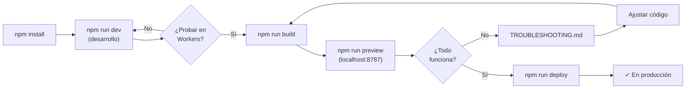

# 📚 Documentación - Cloudflare Workers + OpenNext

Bienvenido. Aquí encontrarás toda la información necesaria para desarrollar, probar y desplegar Space People Counter en Cloudflare Workers.

## 🚀 Comienza Aquí

1. **Primera vez?** → Consulta [CLOUDFLARE_QUICK_START.md](CLOUDFLARE_QUICK_START.md)
2. **Listo para desplegar?** → Lee [DEPLOY_CLOUDFLARE.md](DEPLOY_CLOUDFLARE.md)
3. **Algo no funciona?** → Busca en [TROUBLESHOOTING.md](TROUBLESHOOTING.md)

## 📋 Índice de Documentos

### Inicio Rápido
| Documento | Descripción | Audiencia |
|-----------|-------------|-----------|
| [CLOUDFLARE_QUICK_START.md](CLOUDFLARE_QUICK_START.md) | Comandos esenciales y setup inicial | Todos |
| [MIGRATION_SUMMARY.md](../MIGRATION_SUMMARY.md) | Cambios realizados en la migración | Desarrolladores |

### Deployment & Configuración
| Documento | Descripción | Audiencia |
|-----------|-------------|-----------|
| [DEPLOY_CLOUDFLARE.md](DEPLOY_CLOUDFLARE.md) | Guía completa de deployment | DevOps/Desarrolladores |
| [OPENNEXT_BUILD_OUTPUT.md](OPENNEXT_BUILD_OUTPUT.md) | Estructura de carpeta generada | Técnicos |

### Verificación & Testing
| Documento | Descripción | Audiencia |
|-----------|-------------|-----------|
| [CLOUDFLARE_COMPATIBILITY_CHECKLIST.md](CLOUDFLARE_COMPATIBILITY_CHECKLIST.md) | Checklist pre-deployment | QA/Desarrolladores |

### Ayuda
| Documento | Descripción | Audiencia |
|-----------|-------------|-----------|
| [TROUBLESHOOTING.md](TROUBLESHOOTING.md) | Solución de problemas comunes | Todos |

## 🔄 Workflow Típico



## ⌨️ Comandos Rápidos

```bash
# Desarrollo
npm run dev              # Localhost Next.js
npm run build            # Compilar
npm run preview          # Preview local de Workers (localhost:8787)
npm run deploy           # Deploy a Cloudflare Workers

# Debugging
npx wrangler tail        # Ver logs en vivo
npx wrangler login       # Autenticarse
```

## 🎯 Tareas Comunes

### Agregar Variable de Entorno

```bash
# Pública (usa en navegador)
# Edita wrangler.toml [env.production.vars]

# Privada (solo servidor)
npx wrangler secret put MI_SECRETO
```

### Cambiar Dominio

1. Edita `wrangler.toml`
2. Agrega route:
   ```toml
   [[routes]]
   pattern = "example.com/*"
   zone_name = "example.com"
   ```
3. Deploy: `npm run deploy`

### Ver Logs en Vivo

```bash
npx wrangler tail --follow --level info
```

### Rollback a Versión Anterior

```bash
npx wrangler deployments rollback
```

## 🔐 Primeros Pasos (Paso a Paso)

### 1️⃣ Instalar & Autenticar
```bash
npm install --legacy-peer-deps
npx wrangler login
```

### 2️⃣ Probar Localmente
```bash
npm run build
npm run preview
# Abre http://localhost:8787
```

### 3️⃣ Verificar APIs
```bash
# En otro terminal
curl http://localhost:8787/api/space-people
curl http://localhost:8787/api/iss-location
curl http://localhost:8787/api/health
```

### 4️⃣ Deploy
```bash
npm run deploy
# Tu app estará en https://spacepeople.workers.dev
```

## 📊 Estructura del Proyecto

```
space-people-counter/
├── docs/
│   ├── INDEX.md (este archivo)
│   ├── CLOUDFLARE_QUICK_START.md
│   ├── DEPLOY_CLOUDFLARE.md
│   ├── CLOUDFLARE_COMPATIBILITY_CHECKLIST.md
│   ├── TROUBLESHOOTING.md
│   └── OPENNEXT_BUILD_OUTPUT.md
│
├── wrangler.toml              # Configuración de Cloudflare Workers
├── .opennext.config.ts        # Configuración de OpenNext
├── package.json               # Scripts: build, preview, deploy
│
├── src/
│   ├── app/api/               # Route Handlers (no requieren cambios)
│   ├── components/            # Componentes React
│   ├── services/              # Servicios API
│   └── ...
└── ...
```

## 🧠 Conceptos Clave

### OpenNext
Adaptador que convierte aplicaciones Next.js en Workers de Cloudflare sin cambiar el código de tu aplicación.

**Flujo**:
```
Next.js (App Router)
    ↓
OpenNext (adapta a Workers)
    ↓
Cloudflare Workers (ejecuta)
```

### Route Handlers
Tus archivos en `src/app/api/*/route.ts` funcionan sin cambios:

```typescript
export async function GET() {
  return NextResponse.json({ data });
}
```

OpenNext automáticamente:
- Compila el código
- Lo hace compatible con Workers
- Maneja las rutas `/api/*`

### Assets Estáticos
Imágenes, CSS, JavaScript se sirven desde el CDN global de Cloudflare:
- Caché automático
- Compresión
- Distribución global

## 📞 Soporte

| Recurso | URL |
|---------|-----|
| OpenNext Docs | https://opennext.js.org/ |
| Wrangler Docs | https://developers.cloudflare.com/workers/wrangler/ |
| Cloudflare Community | https://community.cloudflare.com/ |
| Status Page | https://www.cloudflarestatus.com/ |

## ✅ Checklist Inicial

- [ ] Instalaste dependencias: `npm install --legacy-peer-deps`
- [ ] Hiciste login: `npx wrangler login`
- [ ] Buildeo local: `npm run build`
- [ ] Preview funciona: `npm run preview`
- [ ] APIs responden en preview
- [ ] Leíste [DEPLOY_CLOUDFLARE.md](DEPLOY_CLOUDFLARE.md)
- [ ] Ejecutaste: `npm run deploy`
- [ ] Verificaste en: https://spacepeople.workers.dev

## 🎓 Aprende Más

### Conceptos
- [Qué es OpenNext](https://opennext.js.org/)
- [Cloudflare Workers Basics](https://developers.cloudflare.com/workers/get-started/guide/)
- [Next.js 15 App Router](https://nextjs.org/docs/app)

### Avanzado
- [Usar KV Storage](DEPLOY_CLOUDFLARE.md#usando-kv-para-cache-distribuido)
- [CI/CD con GitHub Actions](DEPLOY_CLOUDFLARE.md#cicd-con-github-actions)
- [Durable Objects](https://developers.cloudflare.com/workers/platform/durable-objects/)

## 📝 Notas Importantes

### ✅ Compatible
- Todo el código en `src/app/api/*` funciona tal cual
- React components
- TypeScript
- CSS/Tailwind
- Imágenes optimizadas

### ⚠️ Limitaciones
- Sin acceso a sistema de archivos (usa Web APIs)
- Timeout de 30 segundos en Workers
- Bundle < 10MB idealmente

### 💡 Recomendaciones
- Usa `npm run preview` para probar antes de deploy
- Revisa logs con `npx wrangler tail`
- Consulta [TROUBLESHOOTING.md](TROUBLESHOOTING.md) si hay errores

## 🚀 Próximas Mejoras Posibles

- [ ] Usar KV para cache distribuido
- [ ] Agregar Durable Objects para estado global
- [ ] Implementar CI/CD automático
- [ ] Configurar dominio personalizado
- [ ] Agregar rate limiting

---

**¿Preguntas?** Consulta el archivo relevante o abre un issue.

**Última actualización**: enero 2026 ✓
